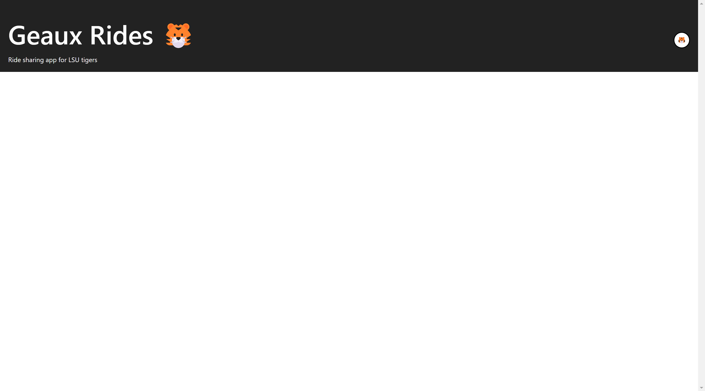
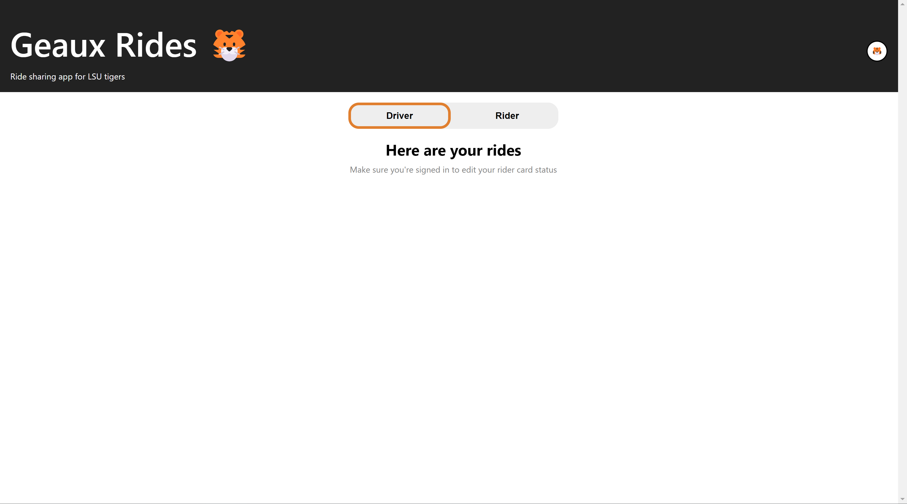
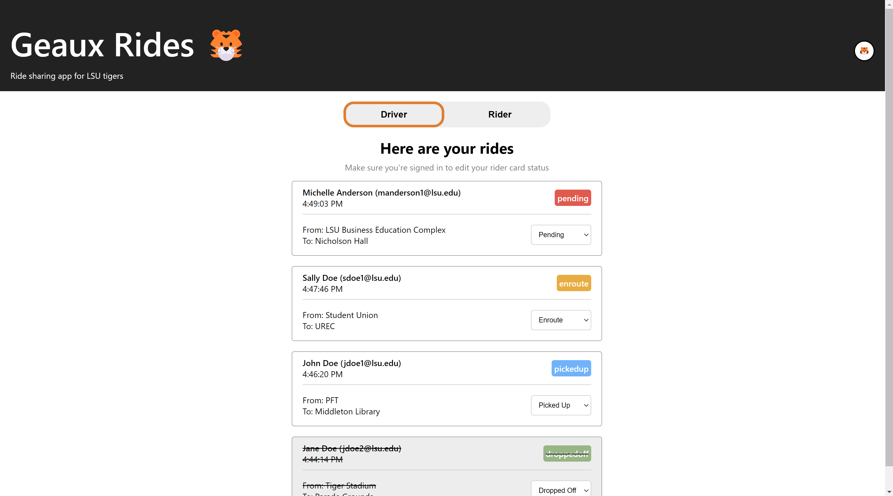

# React Beginner Ride Sharing App

A ride sharing app exclusively for LSU tigers! 🐯

This project is a sample app mainly to help learn beginner level react.

## Code Along

The project is divider into 9 step. Each step has its own `StarterCode` and `SolutionCode` branches.

### Steps

- Step 1

- Step 2

[Step2-SolutionCode.webm](https://user-images.githubusercontent.com/58085744/216477023-eabbde09-3ed0-4319-ad58-a8dd969d6f81.webm)

- Step 3

[Step3-SolutionCode.webm](https://user-images.githubusercontent.com/58085744/216477123-2da8de0c-f21b-45b6-a124-8f75bac5f4ae.webm)

- Step 4

- Stpe 5

- Step 6

[Step6-SolutionCode.webm](https://user-images.githubusercontent.com/58085744/216477265-2aa28f33-92b1-4808-85fe-912fbfe271d8.webm)

- Step 7

[Step7-SolutionCode.webm](https://user-images.githubusercontent.com/58085744/216477278-3cb7a441-e1b0-4514-99a2-d3ccf0097719.webm)

- Step 8

[Step8-SolutionCode.webm](https://user-images.githubusercontent.com/58085744/216477281-6e5877c5-fbe3-4d2d-8920-67d7b196554a.webm)

- Step 9

[Step9-SolutionCode.webm](https://user-images.githubusercontent.com/58085744/216477295-48e60e34-e36c-466e-afc8-b5edb934d431.webm)
